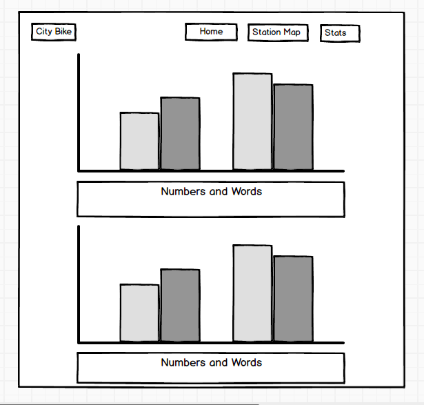

### CityBike App
 The City Bike is to promote healthy lifestlye for new yorkers 
and reduce air pollution by riding bikes. This app provides information regarding where Citi Bike stations are located, how many available bikes and empty docks are. It also shows charts about the total calories burned by riders and the total carbon Citi Bike riders offset each month in 2017.

# Wireframes

## User stories 
*  As a user, I want to see how to use City Bike.
*  I want to see bike stations available on a map.
*  I want to see available bikes, available docks and station name in each station.
*  I want to see when data is updated. 
*  I want to see how many calories burned per month by all bike rides.
*  I want to see how many pounds of carbon offset by citi bike riders per month.

## Technologies 
*  JavaScript
*  Node.js/Express
*  React
*  Google Maps API
*  Citibike API
*  Google Charts 

### Features

* Citi bike API call from server
* Google Maps API in React
* Showing each station with station name, available bikes and docks information on a Google Map
* Google Charts in React with some statistics

# Future expansion 
* Search box for station
